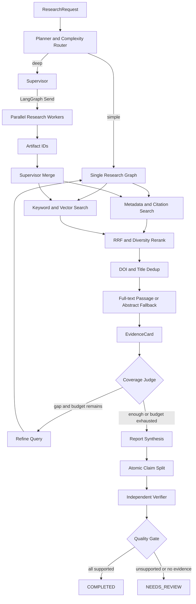

# 架构说明

## 目标

第一版优先证明三个能力：研究循环可以被预算约束、报告结论可以追溯到精确证据、生成结果可以被独立质量门禁拦截。

## 分层

- `domain.py`：稳定的科研数据契约，不依赖框架。
- `providers.py`：外部学术检索端口和适配器，失败隔离、DOI/标题归并。
- `ingestion.py`：GROBID multipart 客户端和 TEI → Passage/引用边转换。
- `retrieval.py`：关键词、向量、元数据、引用图召回契约，RRF 与 reranker。
- `postgres_index.py`：PostgreSQL `tsvector`、pgvector HNSW 和持久化引用边。
- `semantic_scholar.py`：Semantic Scholar 搜索与一跳引用邻域。
- `reasoner.py`：规划、证据抽取、综合和验证端口。默认确定性实现保证离线复现。
- `llm_reasoner.py`：原生 JSON Schema 输出、语义后校验、调用指标和阶段级 fallback。
- `prompts.py`：四个职责隔离且有版本号的系统提示词。
- `workflow.py`：LangGraph 节点、条件边、checkpoint、预算和门禁。
- `application.py`：同步/异步用例和运行状态。
- `api.py`：HTTP 边界，不承载业务规则。
- `artifacts.py`：并行 Worker 的 run-scoped 大对象交接，图状态只保存引用。
- `run_store.py`：运行快照持久化和数据库级幂等约束。
- `events.py`：SSE 事件的有界回放与实时 fan-out。
- `observability.py`：Prometheus 运行指标、质量摘要和可选 OTLP trace。
- `citations.py`：从规范化 Paper 生成 BibTeX 和 CSL JSON。
- `evaluation.py`：独立于运行链路的质量指标。

## 关键决策

### 为什么不直接使用预制 ReAct Agent

科研任务的 DOI 归一化、预算扣减、引用 ID 和质量门禁是确定性规则。状态图把这些规则固定为代码，只把查询规划、证据理解和综合等开放问题交给 reasoner。

### 为什么默认使用离线 reasoner

项目首先需要可重复的架构基线。离线实现使 CI 不依赖密钥、模型版本和远端限流。接入 LLM 后必须继续通过同一组领域契约和评测门槛。

### 结构化模型边界

四个模型阶段分别使用 `PlanOutput`、`EvidenceOutput`、`SynthesisOutput` 和 `VerificationOutput`，不能互相越权。Provider 原生 schema 只保证 JSON 形状，代码还会检查：

- 查询数量、空值和研究范围；
- EvidenceCard 的 passage ID 由系统注入；
- Claim 引用的 evidence ID 必须属于输入白名单；
- Verifier 只能看到 Claim 绑定的 Passage；
- 置信度范围、空 Claim、未知引用等语义不变量。

每次调用产生 `ModelInvocation`，保存 stage、provider、model、prompt version、latency、token、费用估算和错误类型。价格由运行配置提供，避免在代码中冻结易变信息。结构化或语义验证连续失败两次后，只回退当前阶段，并把失败记录带入最终结果。

### 状态与 Artifact

默认开发模式将序列化后的领域对象放入 LangGraph state，并使用 `InMemorySaver`。
设置 `CHECKPOINT_MODE=postgres` 后，工作流切换到官方 `AsyncPostgresSaver`，由
LangGraph 管理 checkpoint 表；`RUN_STORE_MODE=postgres` 则把任务状态、结果、审阅和
幂等键保存为应用自己的 JSONB 快照。两者职责不同：checkpoint 用于恢复图执行，run
store 用于稳定的 HTTP 查询契约。

下一步生产演进：

- 论文全文和解析文件进入对象存储；
- Passage、EvidenceCard 和 Claim 进入 Artifact Store；
- graph state 只保存 ID 和短摘要，避免上下文膨胀。

### 运行控制与事件

`Idempotency-Key` 在 PostgreSQL 中有唯一约束，重复提交返回原 run；取消会停止当前实例
持有的 asyncio task，并保留最近 checkpoint；恢复用相同 `thread_id/run_id` 从 checkpoint
继续。工作流的节点更新被转换为带单调 sequence 的 SSE 事件，客户端可通过
`after_sequence` 重放断线期间的有界历史。

当前事件 broker、task 注册表和 Artifact Store 都是进程内实现。这意味着单实例和进程
重启恢复已经可演示，但跨副本取消和事件订阅尚不成立；多副本版本需要共享事件总线、
持久化 Artifact、Worker 租约及协作式取消标记。

### 为什么使用 RRF

BM25/`ts_rank_cd`、余弦相似度、元数据相关性和引用图信号的数值范围不同，直接加权会把校准问题隐藏在常数中。当前实现先在各 lane 内排序，再以 `1 / (k + rank)` 融合；cross-encoder 只对候选集重排，不承担全库召回。每个 `RetrievalHit` 保留 lane rank、lane score、融合分数和最终名次，便于离线评测与线上解释。

### 全文退化策略

PDF 上传依次经过文件头/体积校验、GROBID 全文接口、TEI 解析和索引写入。研究查询优先使用命中的全文 Passage；没有全文命中时才从摘要生成 Passage。因此 GROBID 或数据库不可用不会破坏默认离线演示，但生产部署应为 GROBID 503 增加队列、熔断和异步重试。

### 自适应多 Agent

Planner 输出 `SIMPLE/DEEP`。简单请求继续进入原单图，只有可拆成多个独立搜索方向的深度请求才进入 Supervisor。Supervisor 在派发前同时计算查询、工具调用、Worker 和剩余墙钟时间容量，然后用 LangGraph `Send` 创建并行 Worker。

Worker 不直接更新共享 `papers/passages`，而是把 `RetrievalBatch` 写入 Artifact Store，只返回 `ResearchWorkerResult`。该对象包含 Worker/Task ID、ArtifactRef、状态、耗时和错误类型。汇总节点串行读取同一 run 的 Artifact、统一扣减预算并执行去重，规避并行 state channel 冲突和上下文复制。

### 安全边界

OpenAlex/Crossref 地址在代码中固定，来源内容永远按数据处理。远端源失败只产生 warning。未来加入网页/PDF 下载时，必须增加域名、重定向、内网 IP、文件类型和体积校验，并让解析器运行在受限容器。
