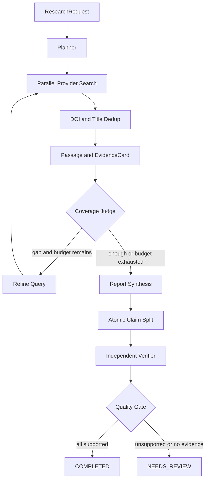

# 架构说明

## 目标

第一版优先证明三个能力：研究循环可以被预算约束、报告结论可以追溯到精确证据、生成结果可以被独立质量门禁拦截。

## 分层

- `domain.py`：稳定的科研数据契约，不依赖框架。
- `providers.py`：外部学术检索端口和适配器，失败隔离、DOI/标题归并。
- `reasoner.py`：规划、证据抽取、综合和验证策略。默认确定性实现保证离线复现。
- `workflow.py`：LangGraph 节点、条件边、checkpoint、预算和门禁。
- `application.py`：同步/异步用例和运行状态。
- `api.py`：HTTP 边界，不承载业务规则。
- `evaluation.py`：独立于运行链路的质量指标。

## 关键决策

### 为什么不直接使用预制 ReAct Agent

科研任务的 DOI 归一化、预算扣减、引用 ID 和质量门禁是确定性规则。状态图把这些规则固定为代码，只把查询规划、证据理解和综合等开放问题交给 reasoner。

### 为什么默认使用离线 reasoner

项目首先需要可重复的架构基线。离线实现使 CI 不依赖密钥、模型版本和远端限流。接入 LLM 后必须继续通过同一组领域契约和评测门槛。

### 状态与 Artifact

当前 MVP 将序列化后的领域对象放入 LangGraph state，使用 `InMemorySaver` checkpoint。生产演进时：

- checkpoint 迁移到 PostgreSQL；
- 论文全文和解析文件进入对象存储；
- Passage、EvidenceCard 和 Claim 进入 Artifact Store；
- graph state 只保存 ID 和短摘要，避免上下文膨胀。

### 安全边界

OpenAlex/Crossref 地址在代码中固定，来源内容永远按数据处理。远端源失败只产生 warning。未来加入网页/PDF 下载时，必须增加域名、重定向、内网 IP、文件类型和体积校验，并让解析器运行在受限容器。
