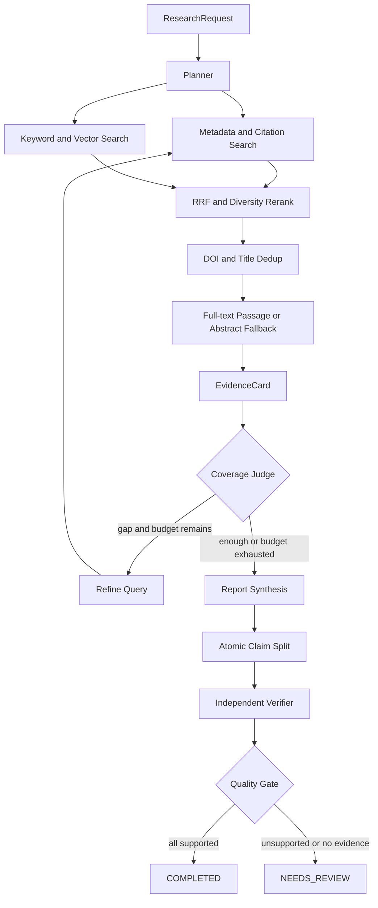

# 架构说明

## 目标

第一版优先证明三个能力：研究循环可以被预算约束、报告结论可以追溯到精确证据、生成结果可以被独立质量门禁拦截。

## 分层

- `domain.py`：稳定的科研数据契约，不依赖框架。
- `providers.py`：外部学术检索端口和适配器，失败隔离、DOI/标题归并。
- `ingestion.py`：GROBID multipart 客户端和 TEI → Passage/引用边转换。
- `retrieval.py`：关键词、向量、元数据、引用图召回契约，RRF 与 reranker。
- `postgres_index.py`：PostgreSQL `tsvector`、pgvector HNSW 和持久化引用边。
- `semantic_scholar.py`：Semantic Scholar 搜索与一跳引用邻域。
- `reasoner.py`：规划、证据抽取、综合和验证端口。默认确定性实现保证离线复现。
- `llm_reasoner.py`：原生 JSON Schema 输出、语义后校验、调用指标和阶段级 fallback。
- `prompts.py`：四个职责隔离且有版本号的系统提示词。
- `workflow.py`：LangGraph 节点、条件边、checkpoint、预算和门禁。
- `application.py`：同步/异步用例和运行状态。
- `api.py`：HTTP 边界，不承载业务规则。
- `evaluation.py`：独立于运行链路的质量指标。

## 关键决策

### 为什么不直接使用预制 ReAct Agent

科研任务的 DOI 归一化、预算扣减、引用 ID 和质量门禁是确定性规则。状态图把这些规则固定为代码，只把查询规划、证据理解和综合等开放问题交给 reasoner。

### 为什么默认使用离线 reasoner

项目首先需要可重复的架构基线。离线实现使 CI 不依赖密钥、模型版本和远端限流。接入 LLM 后必须继续通过同一组领域契约和评测门槛。

### 结构化模型边界

四个模型阶段分别使用 `PlanOutput`、`EvidenceOutput`、`SynthesisOutput` 和 `VerificationOutput`，不能互相越权。Provider 原生 schema 只保证 JSON 形状，代码还会检查：

- 查询数量、空值和研究范围；
- EvidenceCard 的 passage ID 由系统注入；
- Claim 引用的 evidence ID 必须属于输入白名单；
- Verifier 只能看到 Claim 绑定的 Passage；
- 置信度范围、空 Claim、未知引用等语义不变量。

每次调用产生 `ModelInvocation`，保存 stage、provider、model、prompt version、latency、token、费用估算和错误类型。价格由运行配置提供，避免在代码中冻结易变信息。结构化或语义验证连续失败两次后，只回退当前阶段，并把失败记录带入最终结果。

### 状态与 Artifact

当前 MVP 将序列化后的领域对象放入 LangGraph state，使用 `InMemorySaver` checkpoint。生产演进时：

- checkpoint 迁移到 PostgreSQL；
- 论文全文和解析文件进入对象存储；
- Passage、EvidenceCard 和 Claim 进入 Artifact Store；
- graph state 只保存 ID 和短摘要，避免上下文膨胀。

### 为什么使用 RRF

BM25/`ts_rank_cd`、余弦相似度、元数据相关性和引用图信号的数值范围不同，直接加权会把校准问题隐藏在常数中。当前实现先在各 lane 内排序，再以 `1 / (k + rank)` 融合；cross-encoder 只对候选集重排，不承担全库召回。每个 `RetrievalHit` 保留 lane rank、lane score、融合分数和最终名次，便于离线评测与线上解释。

### 全文退化策略

PDF 上传依次经过文件头/体积校验、GROBID 全文接口、TEI 解析和索引写入。研究查询优先使用命中的全文 Passage；没有全文命中时才从摘要生成 Passage。因此 GROBID 或数据库不可用不会破坏默认离线演示，但生产部署应为 GROBID 503 增加队列、熔断和异步重试。

### 安全边界

OpenAlex/Crossref 地址在代码中固定，来源内容永远按数据处理。远端源失败只产生 warning。未来加入网页/PDF 下载时，必须增加域名、重定向、内网 IP、文件类型和体积校验，并让解析器运行在受限容器。
